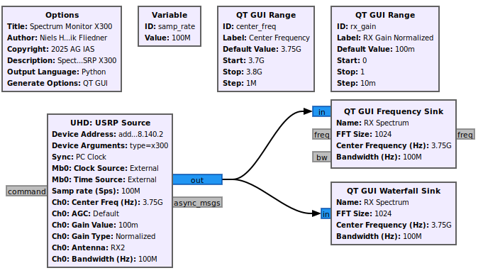
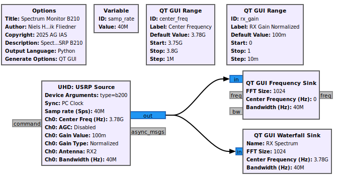
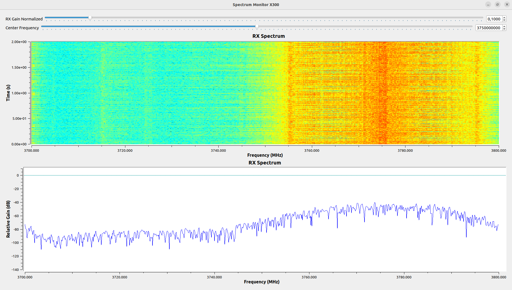

# Spectrum Monitor

Check in GNU Radio under `General`.
`Num Channels` is usually set to `1`. 
Otherwise, more channels are available and you need to ensure you connect the correct one.

Check in GNU Radio SDR block under `RF Options`.
`Ch0` usually represents the output `RF A`.

Hint: A safe way to double-check the correct output is by setting up a spectrum measurement system with a GNU Radio block `UHD: USRP Source` and `QT GUI Frequency Sink`, which will only use the `RX2` connector. 
A small LED will light up at the port (`RF A` or `RF B`) you are using.

## Usage

1. Connect USRP SDR, either B210 or X300. For simplicity, using a USB-driven B210 might be easier for the beginning.
2. Open GNU Radio Companion, load the respective GNU Radio project: [B210-based Spectrum Monitor](#B210-based Spectrum Monitor) or [X300-based Spectrum Monitor](#X300-based Spectrum Monitor).
3. Connect an antenna to the input port of the SDR (marked `RX2`)! Double-check, that you set the correct output port (default: `RF A`)
4. Set your bandwidth by changing the variable `samp_rate` (default: 50 Msps) and the center frequency using the variable `center_freq` (default: 3.78 GHz). The input power can be increased if needed.
5. Double-check, that your antenna is connected to the correct input port. See above on how to do this, if you are unsure.
6. Run the GNU Radio project by clicking the play button (`Execute the flow graph`).

## Setup

Sources:

- [https://wiki.gnuradio.org/index.php/Basic_OFDM_Tutorial](https://wiki.gnuradio.org/index.php/Basic_OFDM_Tutorial)
- [https://github.com/gnuradio/gnuradio/blob/master/gr-digital/examples/ofdm/ofdm_loopback.grc](https://github.com/gnuradio/gnuradio/blob/master/gr-digital/examples/ofdm/ofdm_loopback.grc)
- [https://esrh.me/posts/2022-07-25-gnuradio-ofdm](https://esrh.me/posts/2022-07-25-gnuradio-ofdm)

1. Install GNU Radio.
2. Connect either a USRP B210 or a USRP X300.

The base settings for monitoring the SF OWL 5G Campusnetwork's spectrum are:

| Parameter | Value | Explanation |
|-----------|-------|-------------|
| `samp_rate` | can be set to anything between 200 ksps (`200e3`) to the SDR's maximum bandwidth | The sampling rate, which is also the maximum transmission bandwidth |
| `center_freq` | `3.70e9` to `3.8e9`, default `3.75e9` for X300 and `3.78e9` for B210 | The center frequency |
| `rx_pwr` | `0` to `1`, default `0.1` | The normalized receive power. |
| `Device Address` | `"addr=192.168.140.2"` | The IP address of the X300, if used. |

### X300-based Spectrum Monitor

The X300-based spectrum monitor records the spectral measurement data and displays it in frequency view diagrams.

[`spectrum_monitor_x300.grc`](grc/spectrum_monitor_x300.grc)

### B210-based Spectrum Monitor

The B210-based spectrum monitor records the spectral measurement data and displays it in frequency view diagrams.

[`spectrum_monitor_b210.grc`](grc/spectrum_monitor_b210.grc)

## Example

An example of the full 100 MHz spectrum, with the upper half being jammed.

